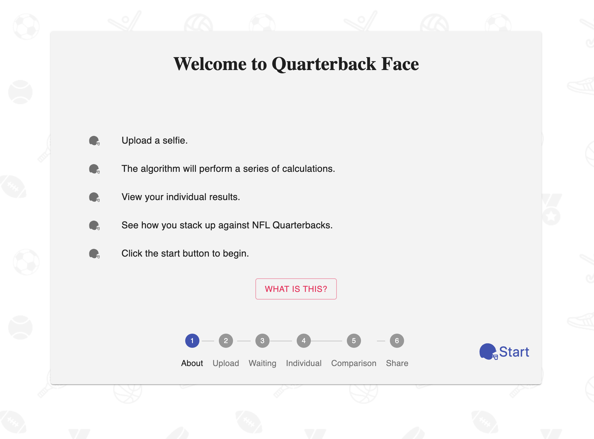
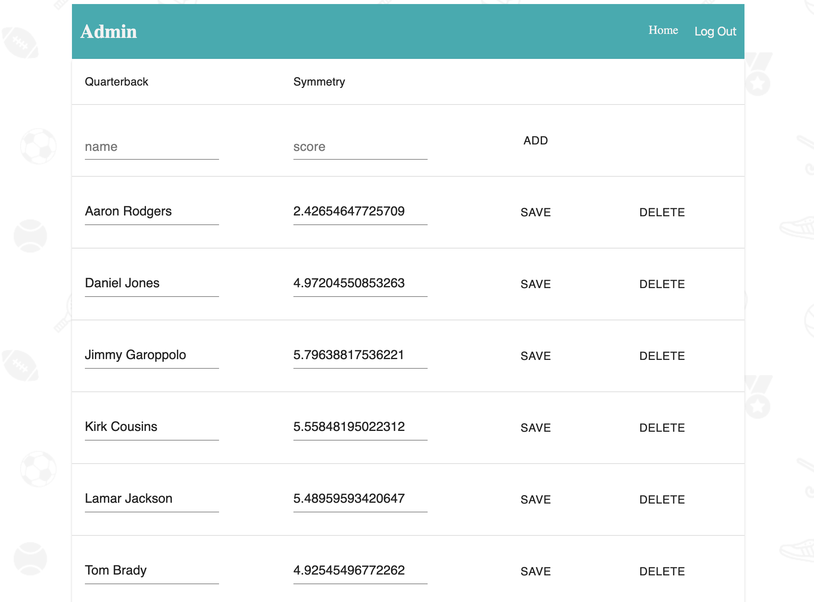

# Quarterback Face

## [Demo](http://quarterbackface.com/)
May take 30-45 seconds to spin up.

## Description
Duration: Two Weeks

A web app that calculates facial symmetry and compares results to NFL Quarterbacks.

## Screen Shot

## Prerequisites

[Node.js](https://nodejs.org/en/)

[PostgreSQL](https://www.postgresql.org/)

## Installation
1. Create a database named `qbface`
2. Use the queries in `database.sql` to set up the tables.
3. From the base directory in your terminal run `npm install` to grab the necessary dependencies. This may take some time.
4. Create an AWS IAM user with full access to S3 and Rekognition.
5. In the base directory edit the file named `DOTENV` with your values and rename it to `.env`.
4. Run `npm run server`
5. In another terminal instance run `npm run client`, the site will load in your default browser. Follow the prompts in your terminal if it cannot determine the default browser.

## Admin Access
1. To register an admin user comment out line 40 from `/server/strategies/user.strategy.js`.
2. Visit `http://localhost:3000/#/admin` and register a user.
3. Edit the `is_admin` column of the `user` table in your database and set it to `true` for the user you created.
4. Uncomment the line from step 1 to prevent other users from registering.
5. Sign in and add Quartersbacks you'd like to be present in the comparison table. Symmetry values are the mean of the 6 values returned to the user. You can uncomment line 15 from `/src/components/Individual/Individual.js` to collect these scores.

## Usage
- Movies display alphabetically 3 at a time. Navigation is done with the `prev` and `next` buttons at the bottom of the page.

- Clicking on a Movie's poster displays more information about the movie as well as an option to edit that information on the database.

- Using the search button at the bottom of the page additional movies can be added to the database. Search by movie title, click on the movie card you would like to add, and confirm your selection.

## Built With
- React
- Material-UI
- javascript
- express
- node.js
- postgreSQL