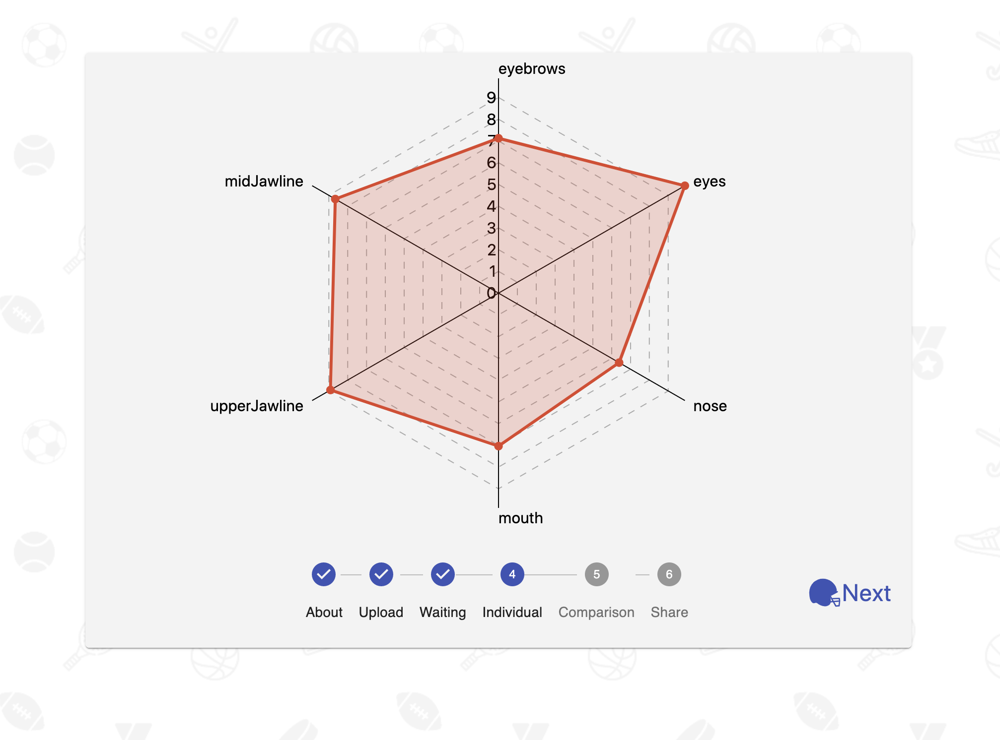

# Quarterback Face

## [Demo](http://quarterbackface.com/)
May take 30-45 seconds to spin up.

## Description
Duration: Two Weeks

A web app that calculates facial symmetry and compares results to NFL Quarterbacks.

## Screen Shot

## Prerequisites

[Node.js](https://nodejs.org/en/)

[PostgreSQL](https://www.postgresql.org/)

## Installation
1. Create a database named `qbface`
2. Use the queries in `database.sql` to set up the tables.
3. From the base directory in your terminal run `npm install` to grab the necessary dependencies. This may take some time.
4. Create an AWS IAM user with full access to S3 and Rekognition.
5. In the base directory edit the file named `DOTENV` with your values and rename it to `.env`.
4. Run `npm run server`
5. In another terminal instance run `npm run client`, the site will load in your default browser. Follow the prompts in your terminal if it cannot determine the default browser.

## Admin Access
1. To register an admin user comment out line 40 from `/server/strategies/user.strategy.js`.
2. Visit `http://localhost:3000/#/admin` and register a user.
3. Edit the `is_admin` column of the `user` table in your database and set it to `true` for the user you created.
4. Uncomment the line from step 1 to prevent other users from registering.
5. Sign in and add Quartersbacks you'd like to be present in the comparison table. Symmetry values are the mean of the 6 values returned to the user. You can uncomment line 15 from `/src/components/Individual/Individual.js` to collect these scores.

## Usage
- From the landing page click the Start button to proceed to the Upload page. Select a photo to upload. For best results use a high quality headshot looking directly into the camera. Once your photo preview has loaded click the Next button to continue.

- You will see a spinning logo while the app is busy crunching the numbers. Once done you will be brough to the individual results page. This radar chart displays the symmetry values calculated from your photo.

- Clicking the Next button will bring you to a comparison view where an average of your individual scores is placed in an ordered list of Quarterbacks.

- The final page prompts you to enter your name, clicking get link will encode your results into a shareable link to send to your friends.

## Built With
- React
- Material-UI
- javascript
- express
- node.js
- postgreSQL
- AWS S3 buckets
- AWS Rekognition API
- chart.xkcd
- Simple Statistics

## Calculations
The method of calculating facial symmetry can be found in `/server/modules/symmetryCalc.js`. (x, y) coordinates of facial features are returned by the AWS Rekognition API. I calculate the midpoints of 6 sets of opposite features and find a linear regression line through those midpoints. The symmetry values returned are the natural logarithm of the difference in distance of each features left and right coordinate from the regression line.

## Other Notes
This app was created purely for entertainment. In my testing I found the AWS Rekognition API returning different results from the same photo day to day.